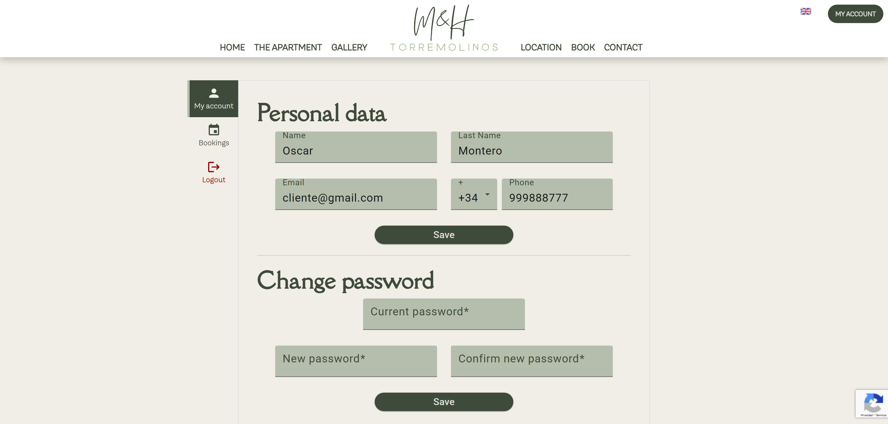
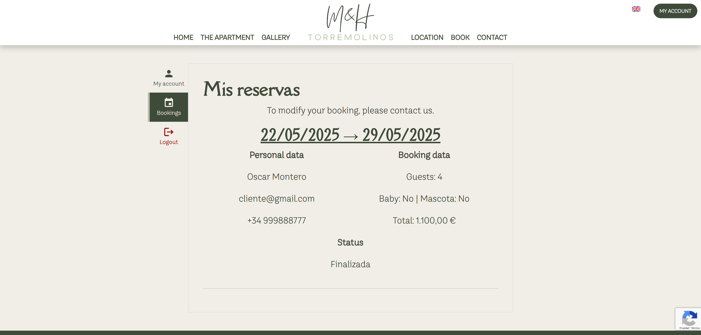

# M&H Torremolinos – Self-managed Apartment Web Platform
<!-- test PR -->

A self-hosted, multilingual web platform designed to manage a real tourist apartment in Torremolinos, Spain. It features a synchronized booking calendar, content management tools, and a modern interface for both customers and administrators.

---

## Overview

> This project was entirely designed, developed, configured, and hosted by myself, from backend to frontend and server deployment.

M&H Torremolinos is a comprehensive solution for managing short-term apartment rentals. The platform enables autonomous administration through a full-featured back office and a customer-facing front office, integrating calendar synchronization with platforms like Booking.com and Airbnb.

### Key Features

- Responsive and multilingual front-end interface
- Real-time calendar synchronization with Booking and Airbnb
- Custom CMS to manage text and image content
- Reservation and user management through a dedicated back office
- Automated email notifications throughout the booking process
- Hosted on a local server with HTTPS and secure configurations

---

## Technology Stack

| Layer        | Technology                            |
|--------------|---------------------------------------|
| Frontend     | Angular 19, Angular Material, PrimeNG |
| Backend      | Node.js 20 with Express               |
| Database     | MySQL                                 |
| Hosting      | Self-hosted with Ubuntu               |
| Web Server   | Apache2 with SSL                      |
| Domain       | mhtorremolinos.com (Hostalia)         |
| Versioning   | Git + GitHub                          |

---

## Front Office

### Homepage

### The Apartment

### Gallery

### Location

### Booking Form

### Contact Page

### Client Panel

### Mobile Version

---

## Back Office

### Calendar Management

### Bookings Dashboard

### User Management

### Text Management

### Image Management

### Mobile Version

---

## Automated Email System

The platform includes an automated email service to streamline communication with guests. Emails are sent during the following key stages:

- Upon reservation request submission
- When a reservation is confirmed or rejected
- To deliver or recover login credentials

Example emails:

---

## Author

Developed by **Oscar Montero**  
[oscarmh02@gmail.com](mailto:oscarmh02@gmail.com)

---

## Production Website

The website is fully deployed and operational as the official booking and management platform for the M&H Torremolinos tourist apartment.

Visit the platform at: [https://mhtorremolinos.com](https://mhtorremolinos.com)
